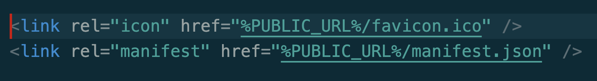

# Deploy React Frontend

[Favicon Generator](https://favicon.io/)
- Find an icon and download
- Open zip file and select favicon.ico
- Drag and replace react favicon with your own
- That's it! Test that it is working :smile:
    - You must have the manifest.json
    - Keep these two lines in index.html
        - 
- If your favicon isn't working compare this repo to yours and make sure you have all of the above