# Deploy React Frontend
## [Live Link](https://missy-klondike.netlify.app/)

1. Sign up for a Netlify account here [Netlify](https://www.netlify.com/)
2. Sign up using GitHub - personal GitHub NOT enterprise 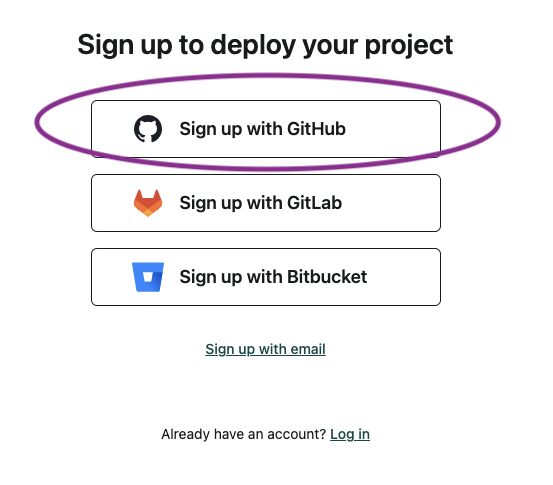
3. Authorize Netlify to access your GitHub repos 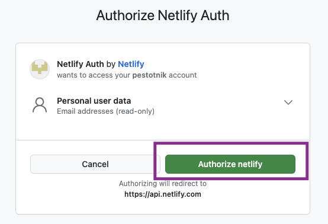
4. Configure personal info on Netlify and continue to deploy 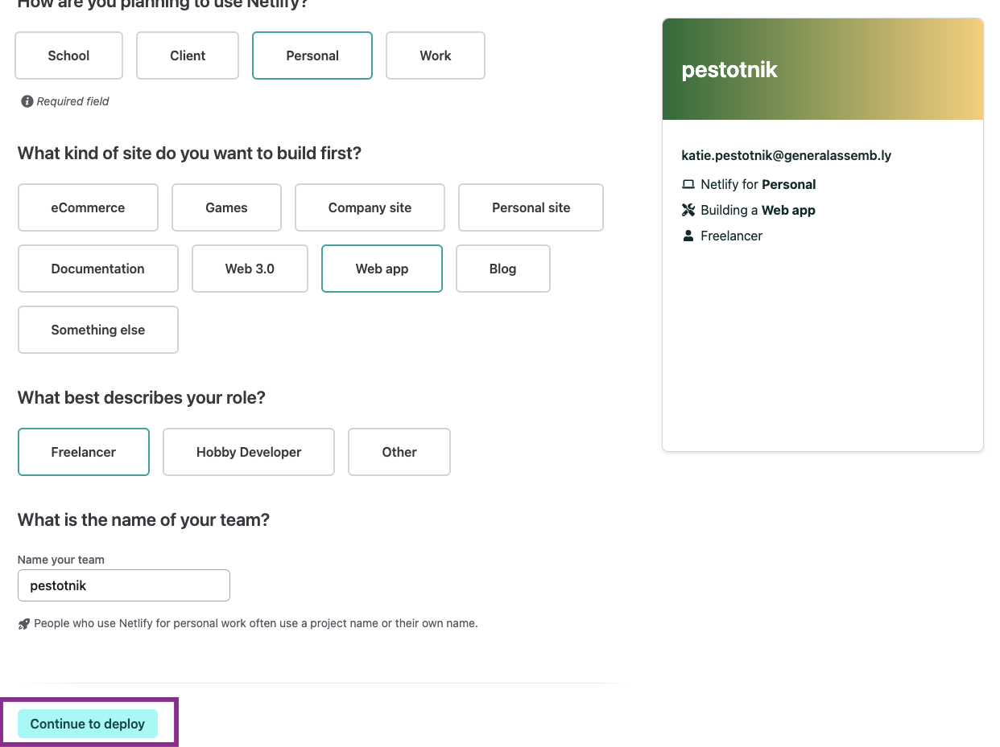
5. Select deploy with GitHub 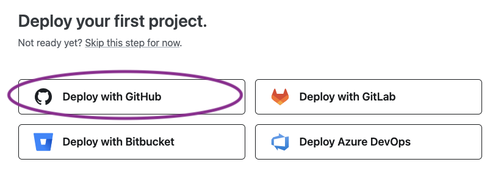
6. Authorize Netlify to use GitHub  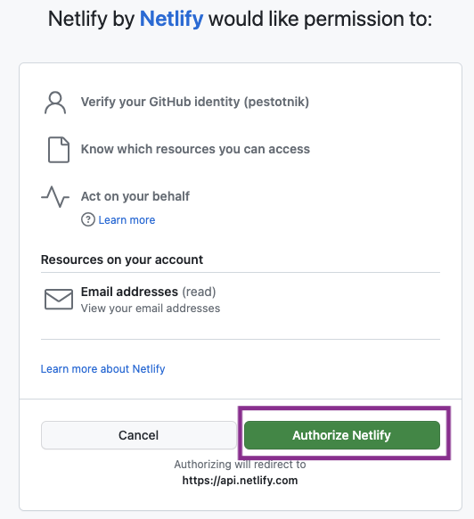
7. Select all repositories and install  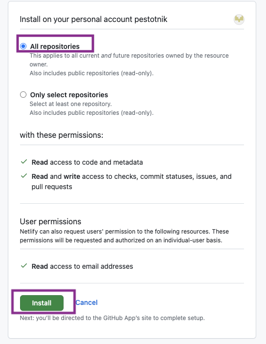
8. Select your project repo 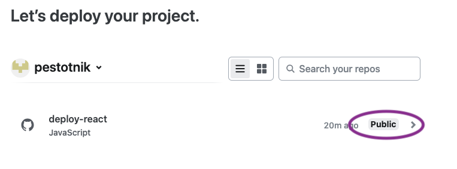
9. Deploy repo!  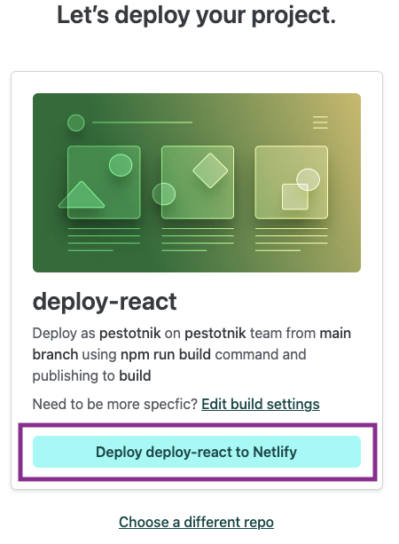
10. Add a netlify.toml at the top level (where package.json lives) to handle redirect errors when user refreshes the page  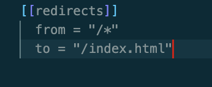
11. Go to deploy settting to change the domain management to change domain name 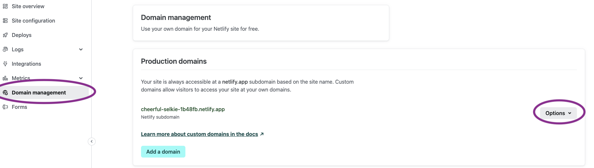
12. Add your live link to your README
   

## Want to use a Favicon?

[Find a favicon here!](https://favicon.io/)
- Find an icon and download
- Open zip file and select favicon.ico
- Drag and replace react favicon with your own
- That's it! Test that it is working :smile:
    - You must have the manifest.json 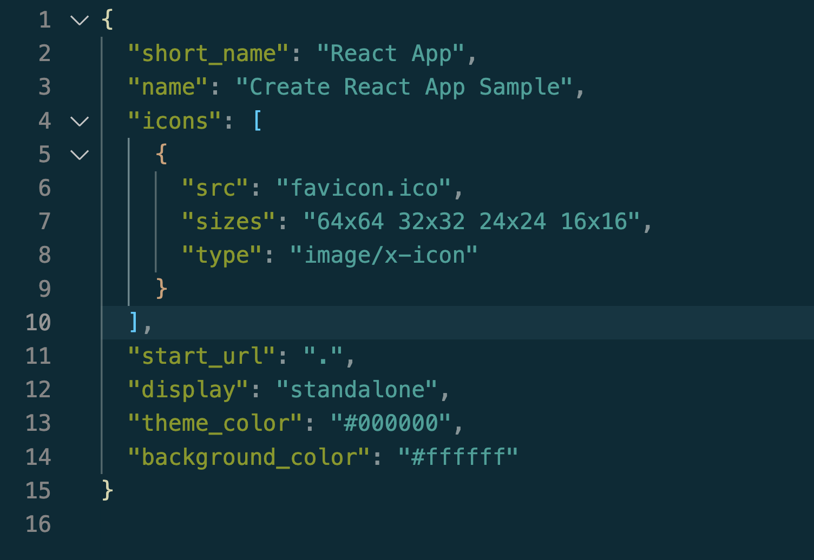
    - Keep these two lines in public/index.html
        - 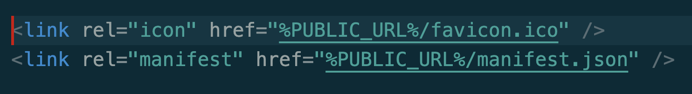
- If your favicon isn't working compare this repo to yours and make sure you have all of the above